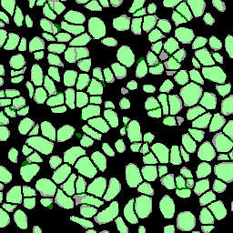

## CONTENTS: ##
1. About
2. Installation
3. Usage
4. Repo Structure
5. Citation

## 1. ABOUT ##
- - - -
Most multiplexed immunofluorescence workflows involve segmenting individual cells from tissue samples. A nuclear marker, such as DAPI, is usually used to segment individual nuclei. The accuracy achievable by segmentation platforms is a persistent bottleneck that is preventing the advancement of the field. To make matters worse, different segmentation platforms perform with varying levels of success on different datasets due to a multitude of factors (cell morphology, illumination differences between microscopes, diffused staining etc.). There is a need for an evaluation scheme to compare nuclear segmentation performance of various platforms for a particular dataset so as to chose one to proceed with.

This repository aims at providing a means for standardized implementation, as well as qualitative and quantitative evaluation of various nuclear segmentation platforms. The code can be tweaked to customize for other platforms being evaluated.

## 2. INSTALLATION ##
- - - - 

## 3. USAGE ##
- - - - 
<b>Segmentation</b>

The first step is to perform nuclear segmentation using the DAPI channel of some sample fields of a multiplex immunofluorescence dataset. We provide detailed notebooks for running CellPose, Mesmer, and StarDist deep learning platforms. The `CellPose_segmentation.ipynb`, `Mesmer_segmentation.ipynb`, and `StarDist_segmentation.ipynb` notebooks allow users to load pre-trained deep learning models, perform nuclear segmentation, and perform necessary post-processing steps to generate nuclear binary masks for evaluation. For inForm and QuPath, morphological parameters need to be optimized, which requires experience and time. We provide general README instructions for this. Upon exporting labels arrays, we provide notebooks `QuPath_postprocessing.ipynb` and `inForm_postprocessing.ipynb` to generate the binary masks for evaluation. We also provide general instructions for segmentation and generation of binary masks using CellProfiler and Fiji as platforms. Users can perform the segmentation with other platforms and integrate binary masks into this pipeline for comparison and evaluation.

<b>Evaluation</b>

The evaluation step comes after segmentation and generation of nuclear binary masks for evaluation using the platforms to be tested. It is recommended to have a directory for each field containing the binary masks from each platform and name them according to their respective platforms (e.g. `StarDist.tiff`).

The next step is the ground truth creation for evaluation. Users can choose a number (we have gone with four) subfields for evaluation from each field. We have gone for a 256X256 size for each subfield. It is advised to choose one subfield from each quadrant of the field to ensure adequate spatial sampling. Additionally, effort should be made to sample two sparse, and two dense regions of nuclei. Once the coordinates for the subfields are chosen, ground truth nuclear masks can be annotate with GIMP. Instructions are provided for creation of ground truth nuclear annotations in GIMP. Again, it is recommended to have a separate directory containing the ground truth binary masks of each field. This is for compatibility with the pipeline. More detailed information can be found in `single_field.ipynb`.

The next step is to evaluate each platform's nuclear segmentation relative to the ground truth annotations for the sampled subfields. This has to be done for each field. It is recommended to use `single_field.ipynb` and change the filepaths to customize for each field. This notebooks allows for qualitative evaluation in the form of platform binary masks overlayed on ground truth masks for comparison as well quantitative evaluation in the form of F1-scores at various IoU thresholds. After running a similar notebook for multiple fields sampled from the dataset, use the `all_fields.ipynb` notebook to combine the data to quantitatively compare the nuclear segmentation performance of the platforms across all the fields sampled from a dataset. This should give an idea of the relative performances of the platforms across the entire dataset for nuclear segmentation.

Qualitatitve platform vs platform comparison on a single evaluation sub-field:
CellPose                           | Mesmer
:---------------------------------:|:----------------------------------------:
 | 

Overall quantitative comparison:

## 4. REPO STRUCTURE ##
- - - - 

## 5. CITATION ##
- - - - 