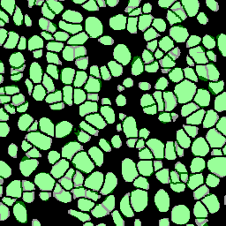
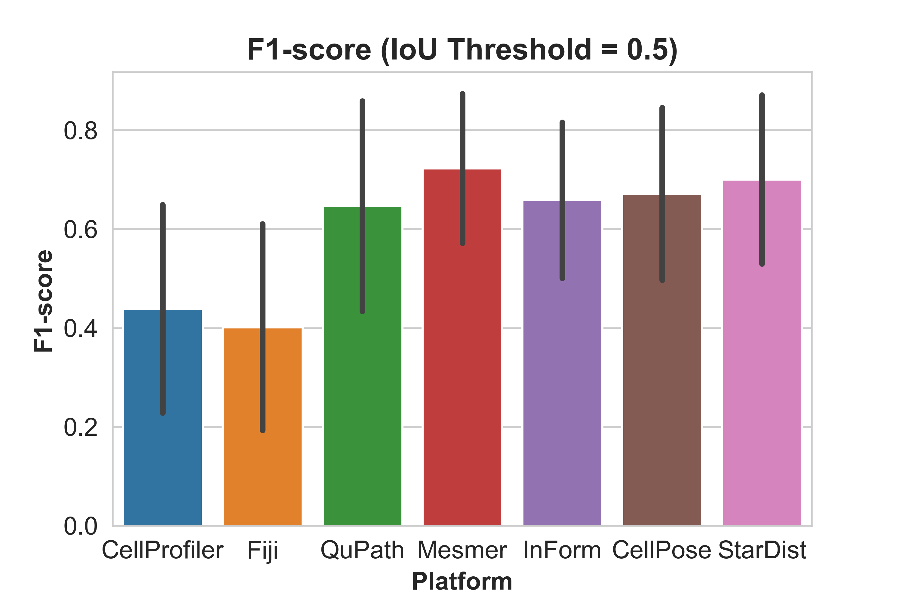
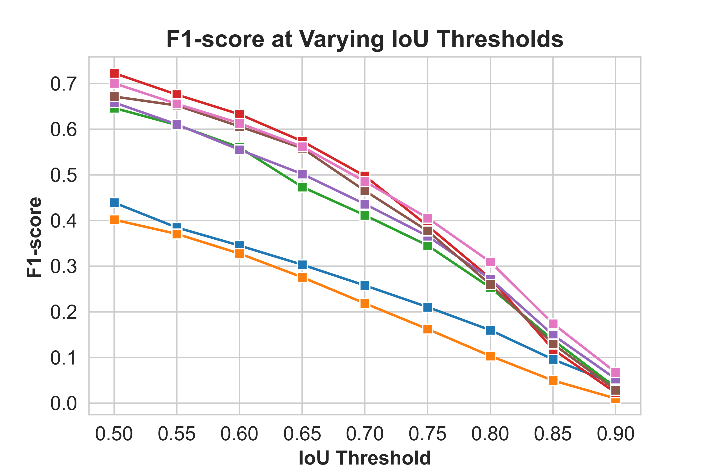

## CONTENTS: ##
1. About
2. Installation
3. Usage

## 1. ABOUT ##
- - - -
Most multiplexed immunofluorescence workflows involve segmenting individual cells from tissue samples. A nuclear marker, such as DAPI, is usually used to segment individual nuclei. The accuracy achievable by segmentation platforms is a persistent bottleneck that is preventing the advancement of the field. To make matters worse, different segmentation platforms perform with varying levels of success on different datasets due to a multitude of factors (cell morphology, illumination differences between microscopes, varying protocols, and stains, different training data for deep learning models, etc.). There is a need for an evaluation scheme to compare the nuclear segmentation performance of various platforms for a particular dataset so as to choose one to proceed with.

This repository aims to provide a means for standardized implementation, as well as qualitative and quantitative evaluation of various nuclear segmentation platforms. The code can easily be adapted and customized for other platforms being evaluated.

## 2. INSTALLATION ##
- - - - 
Linux, Windows and Mac OS are supported for running the code. 

1. Install [Anaconda](https://www.anaconda.com/).

2. Clone this repository by typing `git clone https://github.com/Shachi-Mittal-Lab/nuclear_segmentation.git` in an anaconda/command prompt
   
3. Create and run a virtual environment for this code:
- Windows:
    - From the nuclear_segmentation directory run `conda env create -f environment_windows.yml`.
- Linux:
    - From the nuclear_segmentation directory run `conda env create -f environment_linux.yml`.
- Mac OS:
    - From the nuclear_segmentation directory run `conda env create -f environment_mac.yml`.
    - There are extra steps that may need to be taken for running segmentation notebooks provided in this GitHub for Mac OS users:
        - For running `Mesmer_segmentation.ipynb` it is necessary to install `deepcell-tf` package containing the Mesmer pre-trained model. Guidance for this can be found in the [deepcell-tf GitHub](https://github.com/vanvalenlab/deepcell-tf/tree/master). 
        - Aditionally, if you see `Symbol not found:` errors during `import stardist` in `stardist_segmentation.ipynb`, refer to [this](https://github.com/stardist/stardist/issues/19#issuecomment-535610758).

4. Activate the conda environment with the installed packages and dependencies by typing `conda activate nuclear_seg`.

## 3. USAGE ##
- - - - 
<b>Segmentation</b>

The first step is to perform nuclear segmentation using the DAPI channel of some sample fields of a multiplex immunofluorescence dataset. We provide detailed notebooks for running CellPose, Mesmer, and StarDist deep learning platforms. The `CellPose_segmentation.ipynb`, `Mesmer_segmentation.ipynb`, and `StarDist_segmentation.ipynb` notebooks allow users to load pre-trained deep learning models, perform nuclear segmentation, and perform necessary post-processing steps to generate nuclear binary masks for evaluation. For inForm and QuPath, morphological parameters need to be optimized, which requires experience and time. We provide general guidance for this in `QuPath_segmentation.ipynb` and `inForm_segmentation.ipynb`.Upon exporting nuclear masks from inForm and QuPath, the notebooks also allow for generation of binary masks for evaluation. We also provide general guidance for segmentation and generation of binary masks using CellProfiler and Fiji as platforms in `CellProfiler_segmentation.ipynb` and `Fiji_segmentation.ipynb`. Users can perform the segmentation with other platforms as well and integrate their binary masks into this pipeline during `Evaluation`. The DAPI signal used for segmentation in our paper is available in `imgs/DAPI_grayscale`.

<b>Evaluation</b>

The evaluation step comes after segmentation and generation of nuclear binary masks. The next step is the ground truth creation for evaluation. Guidance for this is in the `score_calculation.ipynb` notebook. The notebook also outlines the recommended file structre for storing platform-derived and ground truth binary nuclear masks for compatibility with the evaluation code. The ground truth annotations of evaluation subfields for the data used in our paper as well as the coordinates of the subfields in the overall field are available in `imgs/ground_truth_masks_coordinates`. `score_calculation.ipynb` produces csv files which contain F1 scores at varying IoU thresholds for the field. After running `score_calculation.ipynb` for each field, feed in the dierctory path to the csv files in `vizualization.ipynb` which will generate evaluations for all the fields combined. Conclusions can then be drawn about which platform to proceed with for the entire dataset.

<b>Imgs</b>

We have also provided the grayscaled DAPI channels for some sample fields along with information about their tissue type in `imgs/DAPI_grayscale`. Additionally, we have coordinates for four evaluation sub-fields as well as their ground truth annotations for each of the sample field in `imgs/DAPI_grayscale/ground_truth_masks_coordinates`. These data can be used to test out the segmentation and evaluation pipelines in this repository.

Qualitatitve, platform vs platform comparison on a single evaluation sub-field:
CellPose                           | Mesmer
:----: | :-----:
 | 

Overall quantitative comparison:
IoU=0.5 | Varying IoUs
:---: | :---:
 | 
