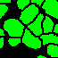

## CONTENTS: ##

* 1\. About
* 2\. Installation
* 3\. Usage
    * 3.1\. Segmenatation
    * 3.2\. Evaluation
    * 3.3\. Results

## 1. ABOUT ##
- - - -
Most multiplexed immunofluorescence workflows involve segmenting individual cells from tissue samples. A nuclear marker, such as DAPI, is usually used to segment individual nuclei. The accuracy achievable by segmentation platforms is a persistent bottleneck that is preventing the advancement of the field. To make matters worse, different segmentation platforms perform with varying levels of success on different datasets due to a multitude of factors (cell morphology, illumination differences between microscopes, varying protocols and stains, different training data for deep learning models, etc.). There is a need for an evaluation scheme to compare the nuclear segmentation performance of various platforms for a particular dataset so as to choose one to proceed with.

This repository aims to provide a means for standardized implementation, as well as qualitative and quantitative evaluation of various nuclear segmentation platforms. The code can easily be adapted and customized for other platforms being evaluated.

## 2. INSTALLATION ##
- - - - 
Linux, Windows and Mac OS are supported for running the code. 

1. Install [Anaconda](https://www.anaconda.com/).

2. Clone this repository by typing `git clone https://github.com/Shachi-Mittal-Lab/nuclear_segmentation.git` in an anaconda/command prompt
   
3. Create and run a virtual environment for this code:
- Windows:
    - From the nuclear_segmentation directory run `conda env create -f environment_windows.yml`.
- Linux:
    - From the nuclear_segmentation directory run `conda env create -f environment_linux.yml`.
- Mac OS:
    - From the nuclear_segmentation directory run `conda env create -f environment_mac.yml`.
    - There are extra steps that may need to be taken for running segmentation notebooks provided in this GitHub for Mac OS users:
        - For running `Mesmer_segmentation.ipynb` it is necessary to install `deepcell-tf` package containing the Mesmer pre-trained model. Guidance for this can be found in the [deepcell-tf GitHub](https://github.com/vanvalenlab/deepcell-tf/tree/master). 
        - Aditionally, if you see `Symbol not found:` errors during `import stardist` in `stardist_segmentation.ipynb`, refer to [this](https://github.com/stardist/stardist/issues/19#issuecomment-535610758).

4. Activate the conda environment with the installed packages and dependencies by typing `conda activate nuclear_seg`.

## 3. USAGE ##
- - - - 
<b>3.1. Segmentation</b>

The first step is to perform nuclear segmentation using the DAPI channel of some sample fields of a multiplex immunofluorescence dataset. We provide detailed notebooks for running CellPose, Mesmer, and StarDist deep learning platforms. The `CellPose_segmentation.ipynb`, `Mesmer_segmentation.ipynb`, and `StarDist_segmentation.ipynb` notebooks allow users to load pre-trained deep learning models, perform nuclear segmentation, and perform necessary post-processing steps to generate nuclear binary masks for evaluation. For inForm and QuPath, morphological parameters need to be optimized, which requires experience and time. We provide general guidance for this in `QuPath_segmentation.ipynb` and `inForm_segmentation.ipynb`.Upon exporting nuclear label masks from inForm and QuPath, the notebooks also allow for generation of binary masks for evaluation. We also provide general guidance for segmentation and generation of binary masks using CellProfiler and Fiji as platforms in `CellProfiler_segmentation.ipynb` and `Fiji_segmentation.ipynb`. Users can perform the segmentation with other platforms as well and integrate their binary masks into this pipeline during `Evaluation`.

<b>3.2. Evaluation</b>

The evaluation step comes after segmentation and generation of nuclear binary masks. The next step is the ground truth creation for evaluation. Guidance for this is in the `evaluation.ipynb` notebook. The notebook also outlines the recommended file structre for storing platform-derived and ground truth binary nuclear masks for compatibility with the evaluation code. `evaluation.ipynb` produces csv files which contain F1-scores at varying IoU thresholds for each evaluatory subregion from all the regions under analysis. `evaluation.ipynb` can then be used to produce visualizations of quantitative evaluation and comparison of segmentation performace between platforms. `evaluation.ipynb` can also be used for qualitative evaluation visualizations. Conclusions can then be drawn about which platform to proceed with for the entire dataset.

<b>3.3. Results</b>

Qualitatitve, platform vs platform comparison on a zoomed in region of interest of a single evaluation sub-region:
|Mesmer|StarDist|Key|
| :----: | :-----: | :-----: |
|Overlay|Overlay||
|  |  |  |
|Precision Mask|Precision Mask|@ IoU Threshold = 0.2|
|  |  |  |
|Recall Mask|Recall Mask|@ IoU Threshold = 0.2|
|  |  |  |
|Precision Mask|Precision Mask|@ IoU Threshold = 0.5|
|  |  |  |
|Recall Mask|Recall Mask|@ IoU Threshold = 0.5|
|  |  |  |
|Precision Mask|Precision Mask|@ IoU Threshold = 0.8|
|  | |  |
|Recall Mask|Recall Mask|@ IoU Threshold = 0.8|
|  | |  |

Quantitative comparison of 7 nuclear segmentation platforms over 20 evaluation ROIs, 3 tissue types (melanoma, tonsil, breast), 3967 nuclei on our in-house development dataset:
IoU Threshold=0.5 | Varying IoU Thresholds
:---: | :---:
 | 

Quantitative comparison of pre-trained deep learning models over 40 evaluation ROIs, 6 tissue types (lung, breast, pancreas, colon, skin, tongue), 16197 nuclei on an external dataset for benchmarking:
IoU Threshold=0.5 | Varying IoU Thresholds
:---: | :---:
 | 

Brief description of some of the platforms above:

- <b>CellProfiler</b> is an open-source system for flexible and varying modes of cell-based image analysis. Nuclear segmentation in CellProfiler is performed by classical techniques of thresholding followed by object detection, including algorithms for declumping nuclei that are touching via watershed. Our Fiji pipeline is similar to another multiplex study that performs segmentation on DAPI images.

- <b>QuPath</b> is an open-source bioimage analysis software designed for digital pathology and whole slide image analysis. It offers algorithms that provide in-built solutions to various workflows, including cell segmentation. QuPath’s cell detection algorithm is an intricate, custom one that uses ImageJ as a library for standard image processing operations like thresholding, watershed, and morphological reconstructions.

- <b>StarDist</b> is a deep learning-based open-source cell detection algorithm that predicts star-convex polygons as a shape representation for nuclei. It uses a lightweight neural network based on the U-Net architecture.  StarDist computes object probabilities and star-convex polygon distances as the normalized Euclidean distance to the nearest background pixel. Pixels with sufficiently high probabilities are considered nuclei, while those without are assigned as background. For every pixel assigned as a nucleus, Euclidean distances in 32 radial directions to pixels with a different object identity (nucleus boundary) are regressed. It is worth noting that StarDist loses pixel-level localization accuracy near object boundaries since the model is only based on 32 radial directions.

- <b>Cellpose</b> is a deep learning-based open-source nuclear segmentation package that predicts horizontal and vertical gradients within a cell from which vector fields can be calculated. Cellpose also uses a neural network based on the U-Net architecture. Cellpose predicts binary maps, indicating if a given pixel is a nucleus or background. All pixels can be routed to the center of their respective cell by following the vector fields using a process called gradient tracking. The algorithm then identifies distinct cells and their precise shapes by grouping together pixels that converge to the same point. Cell shape is further refined by excluding pixels according to the binary map generated. While both platforms are based on U-Net, StarDist has an additional 3×3 convolutional layer with 128 channels and relu activations after the final U-Net feature layer, and Cellpose uses a modified U-Net architecture with the standard building blocks replaced by residual blocks with double the network depth.

- <b>Mesmer</b> is a deep learning-based open-source cell segmentation pipeline that predicts centroid and boundary pixels of nuclei followed by a watershed algorithm. Mesmer also uses membrane or cytoplasm markers to segment whole cells as a more accurate alternative to pixel expansion of nuclear masks, which is commonly the case. The model architecture contains a ResNet50 backbone coupled to a Feature Pyramid Network that has four prediction heads (two for nuclear and two for whole-cell segmentation) at the top of the pyramid. Mesmer was trained on TissueNet, a database with 1.2 million nuclear annotations from a variety of imaging platforms, tissue types, and species.  

